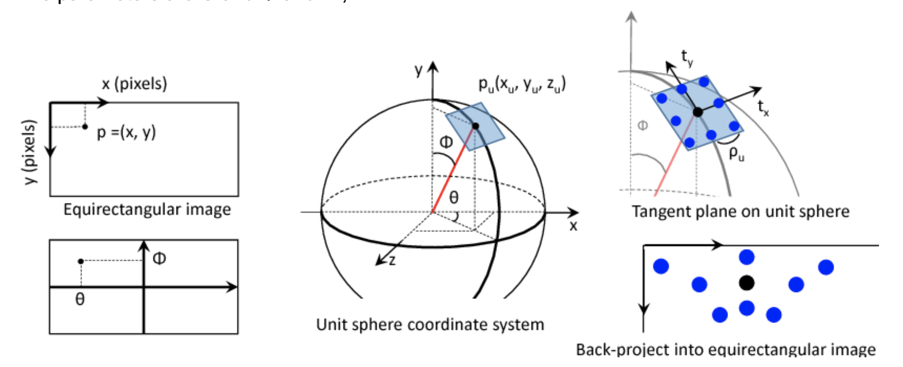

## EquiConv PyTorch implementation

This is the adaptation of the EquiConv part of the Corners for Layout by C. Fernandez et.al (https://arxiv.org/abs/1903.08094)

EquiConv is a [distortion aware deformable convolution](http://openaccess.thecvf.com/content_ECCV_2018/papers/Keisuke_Tateno_Distortion-Aware_Convolutional_Filters_ECCV_2018_paper.pdf) used to process equirectangular images produced from 360 degrees  cameras.

EquiConv can adapt to distortions introduced by the equirectangular projection so that neural networks can recover the depth information needed to reconstruct the 3D layout from the equrectangular images.  

Image credit [K. Tateno et. al.](http://openaccess.thecvf.com/content_ECCV_2018/papers/Keisuke_Tateno_Distortion-Aware_Convolutional_Filters_ECCV_2018_paper.pdf)

Illustration of the EquiConv process. All points in the equirectangular image is first projected into a unit spherical coordinate. The sampling grid is then calculated on the surface of the spherical coordinate before being projected back into the equirectangular image.

This implementation has been tested under this environment:\
python 3.8\
pytorch 1.4\
torchvision 0.5\
cuda 10.1

Run python test.py for testing.     
